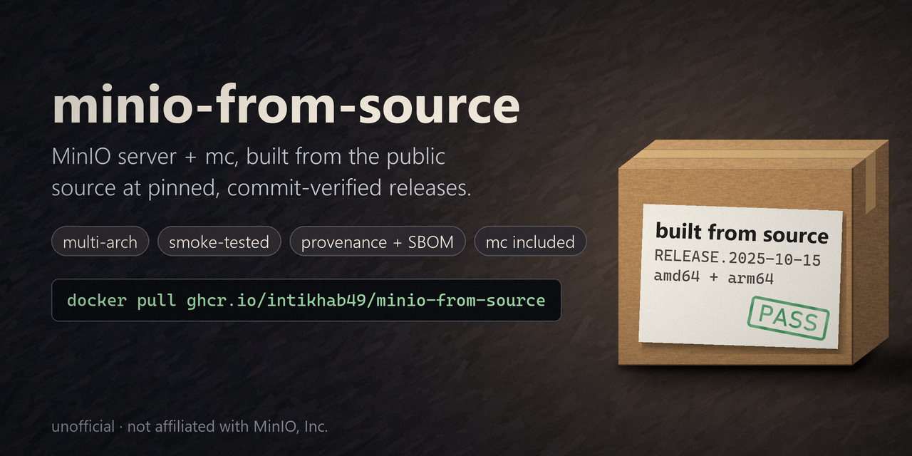
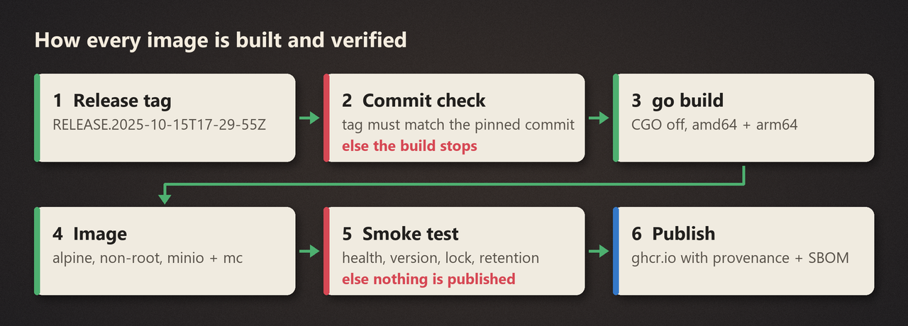

<p align="center">
  
</p>

<h1 align="center">minio-from-source</h1>

<p align="center">
  <b>A pinnable MinIO Docker image, now that the official ones are gone.</b><br>
  MinIO server + <code>mc</code>, built from MinIO's public source at pinned, commit-verified releases.
</p>

<p align="center">
  <a href="https://github.com/intikhab49/minio-from-source/actions/workflows/build.yml"></a>
  <a href="https://github.com/intikhab49/minio-from-source/pkgs/container/minio-from-source"></a>
  
  
  <a href="LICENSE"></a>
  <a href="NOTICE"></a>
</p>

<p align="center">
  <a href="#quick-start">Quick start</a> ·
  <a href="#image-tags">Tags</a> ·
  <a href="#how-each-image-is-built-and-verified">How it's built</a> ·
  <a href="#build-it-yourself">Build it yourself</a> ·
  <a href="#faq">FAQ</a>
</p>

> [!IMPORTANT]
> **Unofficial.** Not affiliated with or endorsed by MinIO, Inc. "MinIO" is a trademark of MinIO, Inc. and is used here only to describe what the image contains.

## Seeing one of these?

MinIO stopped publishing free Docker images and binaries in October 2025. If your CI, `docker-compose.yml` or Helm values pull MinIO, it now fails with one of these:

```text
# Docker Hub (minio/minio, minio/mc): the repositories were removed
Error response from daemon: pull access denied for minio/minio, repository does not exist or may require 'docker login'

# quay.io/minio/minio, quay.io/minio/mc: anonymous pulls are refused
Error response from daemon: unauthorized: access to the requested resource is not authorized

# dl.min.io binary downloads
HTTP/1.1 410 Gone
```

The source is still public (AGPL-3.0). This repo builds it for you, at an exact release you can pin. For most setups, **swapping one image line gets you running again** (see the note on existing volumes below).

## Quick start

### docker run

```bash
docker run -d --name minio -p 9000:9000 -p 9001:9001 \
  -e MINIO_ROOT_USER=admin -e MINIO_ROOT_PASSWORD=change-me-please \
  -v minio_data:/data \
  ghcr.io/intikhab49/minio-from-source:RELEASE.2025-10-15T17-29-55Z
```

### docker compose

Replace your old `minio/minio` or `quay.io/minio/minio` line:

```yaml
services:
  minio:
    image: ghcr.io/intikhab49/minio-from-source:RELEASE.2025-10-15T17-29-55Z
    command: server /data --console-address ":9001"
    environment:
      MINIO_ROOT_USER: admin
      MINIO_ROOT_PASSWORD: change-me-please
    ports: ["9000:9000", "9001:9001"]
    volumes: ["minio_data:/data"]
    healthcheck:
      test: ["CMD", "curl", "-fsS", "http://localhost:9000/minio/health/live"]
      interval: 10s
      retries: 5
volumes:
  minio_data:
```

### GitHub Actions

This repo is also a GitHub Action. It starts the server, waits until it is healthy, creates your buckets and hands you the endpoint:

```yaml
- uses: intikhab49/minio-from-source@v1
  id: minio
  with:
    version: RELEASE.2025-10-15T17-29-55Z   # or latest
    buckets: uploads, reports               # optional
    # object-lock: true                     # create the buckets with object locking
- run: npm test
  env:
    S3_ENDPOINT: ${{ steps.minio.outputs.endpoint }}   # http://127.0.0.1:9000
    AWS_ACCESS_KEY_ID: minioadmin
    AWS_SECRET_ACCESS_KEY: minioadmin
```

| Input | Default | What it does |
| --- | --- | --- |
| `version` | `latest` | Image tag to run. Pin a `RELEASE.*` tag for reproducible builds |
| `port` / `console-port` | `9000` / `9001` | Host ports for the S3 API and the web console |
| `root-user` / `root-password` | `minioadmin` / `minioadmin` | Credentials, which are also the access and secret key |
| `buckets` | none | Buckets to create, separated by spaces or commas |
| `object-lock` | `false` | `true` creates the buckets with object locking (and versioning) |
| `container-name` | `minio` | For `docker logs` or `docker exec` in later steps |

Outputs: `endpoint`, `console` and `container`. Linux runners only, since it runs a Docker container.

Or start it yourself:

```yaml
- name: Start MinIO
  run: |
    docker run -d --name minio -p 9000:9000 \
      -e MINIO_ROOT_USER=admin -e MINIO_ROOT_PASSWORD=change-me-please \
      ghcr.io/intikhab49/minio-from-source:RELEASE.2025-10-15T17-29-55Z
    until curl -fsS http://localhost:9000/minio/health/live; do sleep 1; done
```

### Create buckets with `mc`

`mc` is in the same image, so no second image is needed:

```bash
docker exec minio sh -c '
  mc alias set local http://localhost:9000 admin change-me-please &&
  mc mb --ignore-existing --with-lock local/my-bucket'
```

> [!NOTE]
> **Reusing a data volume from the old official image?** Those images ran as root, so the files are root-owned. This image runs as the non-root `minio` user. Either run it as root for that volume (`user: "0:0"` in compose, `--user 0` with `docker run`) or `chown -R` the volume once.

> [!TIP]
> Pin the full release tag (`RELEASE.2025-10-15T17-29-55Z`), not `latest`. Your storage server shouldn't change under you.

## Image tags

| Tag | MinIO server | mc | Platforms |
|---|---|---|---|
| `RELEASE.2025-10-15T17-29-55Z`, `latest` | `RELEASE.2025-10-15T17-29-55Z` · [`9e49d5e`](https://github.com/minio/minio/commit/9e49d5e7a648f00e26f2246f4dc28e6b07f8c84a) | `RELEASE.2025-08-13T08-35-41Z` · [`7394ce0`](https://github.com/minio/mc/commit/7394ce0dd2a80935aded936b09fa12cbb3cb8096) | amd64, arm64 |
| `RELEASE.2025-09-07T16-13-09Z` | `RELEASE.2025-09-07T16-13-09Z` · [`07c3a42`](https://github.com/minio/minio/commit/07c3a429bfed433e49018cb0f78a52145d4bedeb) | `RELEASE.2025-08-13T08-35-41Z` · [`7394ce0`](https://github.com/minio/mc/commit/7394ce0dd2a80935aded936b09fa12cbb3cb8096) | amd64, arm64 |

Every image carries build provenance and an SBOM, plus OCI labels with both commit ids:

```bash
docker inspect ghcr.io/intikhab49/minio-from-source:latest \
  --format '{{ index .Config.Labels "io.github.minio-from-source.minio-commit" }}'
```

## How each image is built and verified

<p align="center">
  
</p>

The smoke test runs against every release before anything is published:

| Check | What it proves |
|---|---|
| Health endpoint answers | the server starts |
| `minio --version` is exactly the pinned release | the right source, and the version string isn't mangled |
| `mc mb --with-lock` + versioning on | object locking works |
| write, then read back the same bytes | storage round-trips |
| default `COMPLIANCE` retention set and read | retention rules work |

Images are published only from `main` of this repository, never from pull requests or forks.

## Build it yourself

```bash
git clone https://github.com/intikhab49/minio-from-source && cd minio-from-source
docker build -t minio-from-source .          # newest pinned release
```

Any other release:

```bash
scripts/resolve-release.sh minio RELEASE.2025-09-07T16-13-09Z
# RELEASE.2025-09-07T16-13-09Z 07c3a429bfed433e49018cb0f78a52145d4bedeb

docker build \
  --build-arg MINIO_TAG=RELEASE.2025-09-07T16-13-09Z \
  --build-arg MINIO_COMMIT=07c3a429bfed433e49018cb0f78a52145d4bedeb \
  -t minio-from-source:RELEASE.2025-09-07T16-13-09Z .

scripts/smoke-test.sh minio-from-source:RELEASE.2025-09-07T16-13-09Z RELEASE.2025-09-07T16-13-09Z
```

<details>
<summary><b>Trap 1: pinning the tag object instead of the commit</b></summary>

<br>

Some MinIO release tags are **annotated**. For those,

```bash
git ls-remote https://github.com/minio/minio refs/tags/RELEASE.2025-09-07T16-13-09Z
```

returns the **tag object** (`01ce918…`), not the commit (`07c3a42…`). Pin that and any "is this the commit I expect?" check fails. The commit is `refs/tags/<tag>^{}`, and for lightweight tags it's the plain ref. `scripts/resolve-release.sh` handles both.

</details>

<details>
<summary><b>Trap 2: <code>minio --version</code> printing the date twice</b></summary>

<br>

Upstream's `buildscripts/gen-ldflags.go` reads `MINIO_RELEASE` (and `MC_RELEASE` for mc) from the environment as the version **prefix**. If your Dockerfile has a build argument with that name holding the full tag, it leaks into the environment and you get:

```text
minio version RELEASE.2025-09-07T16-13-09Z.2025-09-07T16-13-09Z
```

This repo names its arguments `MINIO_TAG` / `MC_TAG`, sets the prefix to plain `RELEASE`, and the smoke test fails on a mangled version.

</details>

## Maintenance

> [!WARNING]
> These images get security fixes only when someone bumps the pinned release. As of 2026-10-02 the newest upstream release tag is `RELEASE.2025-10-15T17-29-55Z`. Check upstream before you rely on this in production.

Adding a newer release is a three-line PR: run `scripts/resolve-release.sh minio latest`, add a row to the matrix in [`.github/workflows/build.yml`](.github/workflows/build.yml), and update the table above. See [CONTRIBUTING.md](CONTRIBUTING.md).

## Alternatives

| Option | Built from source | Pin a specific release | Notes |
|---|---|---|---|
| **This repo** | yes | yes | minio + mc in one image, smoke-tested |
| [Chainguard MinIO images](https://www.chainguard.dev/unchained/secure-and-free-minio-chainguard-containers) | yes | see their free-tier terms | minimal, hardened images |
| Community mirrors of the last official images | no | only what was mirrored | frozen copies |
| SeaweedFS, Garage, other S3 servers | n/a | n/a | if you're leaving MinIO entirely |

## FAQ

**Is there still a free MinIO Docker image?**
Not from MinIO. This repo publishes one built from their public source: `ghcr.io/intikhab49/minio-from-source`.

**Why does `docker pull minio/minio` fail?**
The Docker Hub repositories were removed, and quay.io now refuses anonymous pulls. See [Seeing one of these?](#seeing-one-of-these).

**Is this a fork? Is anything changed?**
No. Each image is built unmodified from the upstream commit listed in the [tags table](#image-tags).

**Does it run on Apple Silicon / Raspberry Pi / ARM servers?**
Yes. Every tag is multi-arch: `linux/amd64` and `linux/arm64`.

**Can I use it in production?**
It's the same MinIO code, but read [Maintenance](#maintenance) first: you own keeping the release current.

**Is redistributing MinIO allowed?**
MinIO is AGPL-3.0, which permits redistribution with the corresponding source. [NOTICE](NOTICE) points to the exact commit for every image.

## Contributing

Issues and PRs welcome, especially new upstream releases. Use the [issue templates](https://github.com/intikhab49/minio-from-source/issues/new/choose); security reports go through [SECURITY.md](SECURITY.md).

## License

The build files here (Dockerfile, scripts, workflow) are [MIT](LICENSE). The images contain MinIO and mc, which are **AGPL-3.0**; see [NOTICE](NOTICE).
